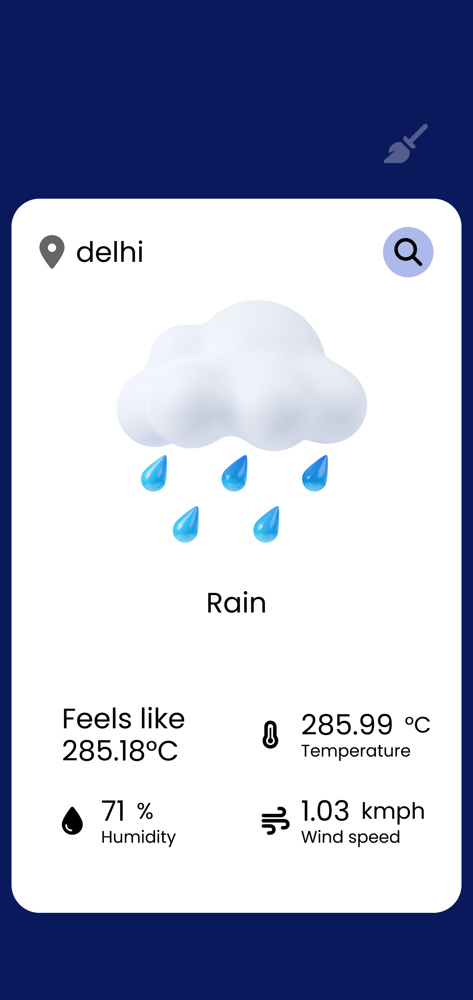

# Weather App

Get the current weather data from openweathermap.org api.

## Preview



## Features

- search by city name and display weather, tempurature, humidity and windspeed.
- autocompletion via fuzzy searching

## Tools

Html, css, scss, js, webpack

## App model


## Practice objective

- api fetching
- design patterns
- simple animations
- reactive programing concepts
- state-machine

## Instruction

Add "API_KEY=<your-api-key>" in .env file for dev or directly as environment variable.

```bash
yarn install
# add env variable
yarn start

```
